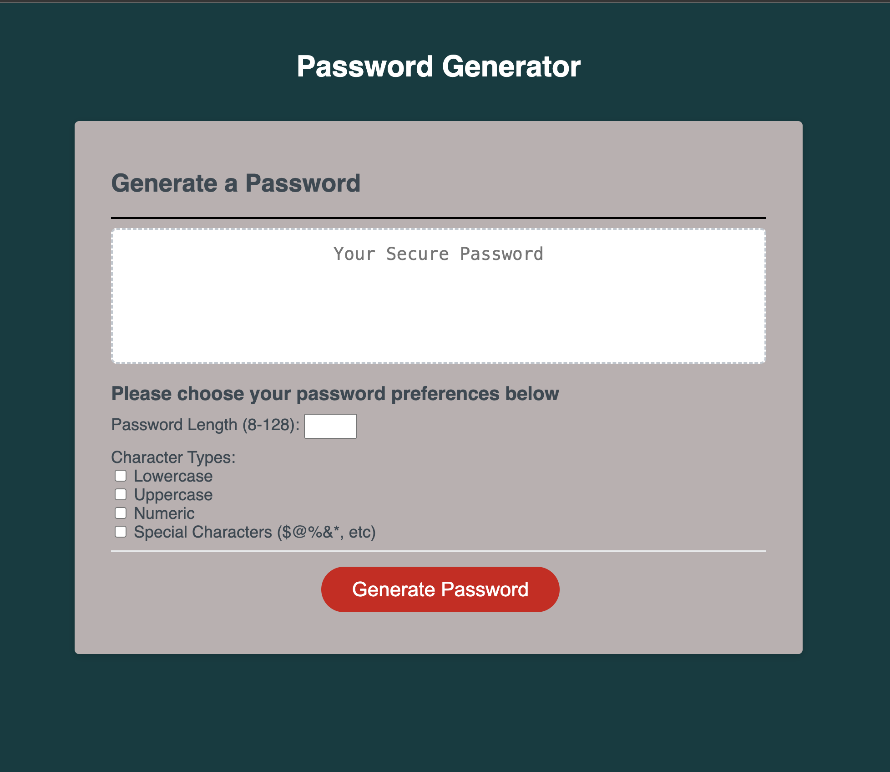
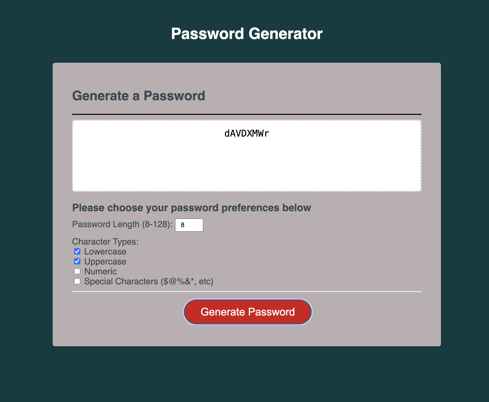
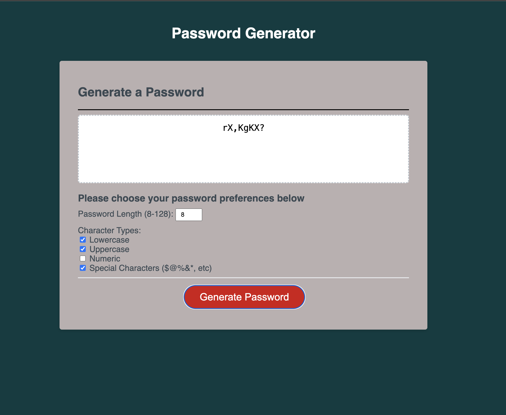

# Password-Generator.
Challenge 5 for Bootcamp at the University of Birmingham.
## Narrative.

 For this task, I needed to develop a password generator that satisfied the specified criteria:

* Create a password upon clicking the button.

* Display a set of prompts for password criteria, including the password length (between 8 and 128 characters) and the inclusion of lowercase, uppercase, numeric, and special characters.
* The code must perform validation for each input, ensuring that at least one character type is selected.
* Upon completion of all prompts, the password should be generated and either presented in an alert or written on the page.

* Requirements for successfully completing this challenge also involved having a GitHub repository and a well-crafted README file.

Engaging in this challenge proved to be a gratifying experience as it deepened my comprehension of effectively employing functions and synergistic collaboration. Additionally, I found great satisfaction in navigating the intricacies of integrating JavaScript seamlessly with both HTML and CSS.

## Utilization

 Visit this page in your web browser. [This page](https://seyiturbo.github.io/password-generator/) Click on the red "Generate Password" button and proceed through the prompts. Once all prompts have been applied, a password will be generated. 

    

    

    

## Credits

I turned to the provided documentation to support me in meeting the requirements of this challenge.

[Read Me Guide](https://coding-boot-camp.github.io/full-stack/github/professional-readme-guide)

[assignments](https://www.w3schools.com/js/js_assignment.asp)

[functions](https://developer.mozilla.org/en-US/docs/Web/JavaScript/Guide/Functions)

[querySelector](https://developer.mozilla.org/en-US/docs/Web/API/Document/querySelector)

[loops and iteration](https://developer.mozilla.org/en-US/docs/Web/JavaScript/Guide/Loops_and_iteration#for_statement/)

